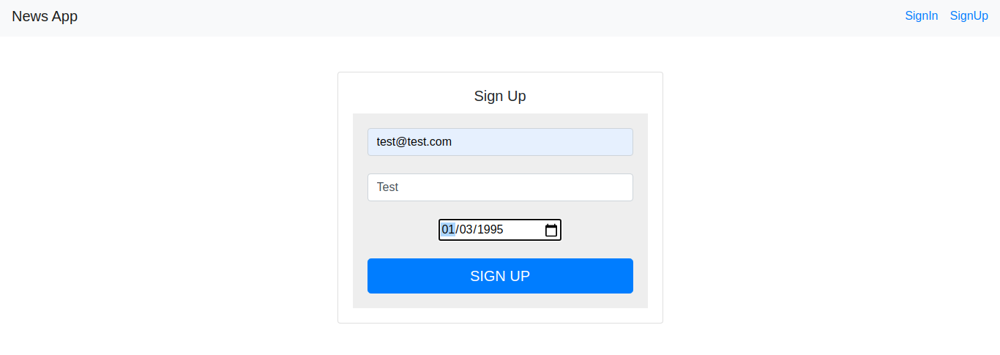
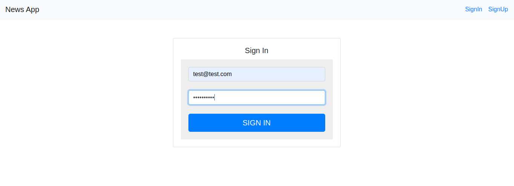
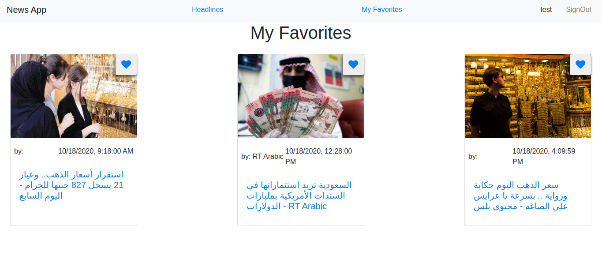

## News-client
This simple project you can use to dispaly news from news backend (Source code exists within my repos), you can easily add news to favorites or delete it from favorites And you can get your favorites back :).

## Basic Concept
* User authentication.
* Add/Delete news to/from favorites.
* User can fetch all favorites.

## Steps to run project
* Dont forget to run (news backend) first.
* Clone project.
* Project setup.
    * `npm install`
* Compiles and hot-reloads for development.
    * `npm run serve`
* Compiles and minifies for production.
    * `npm run build`

